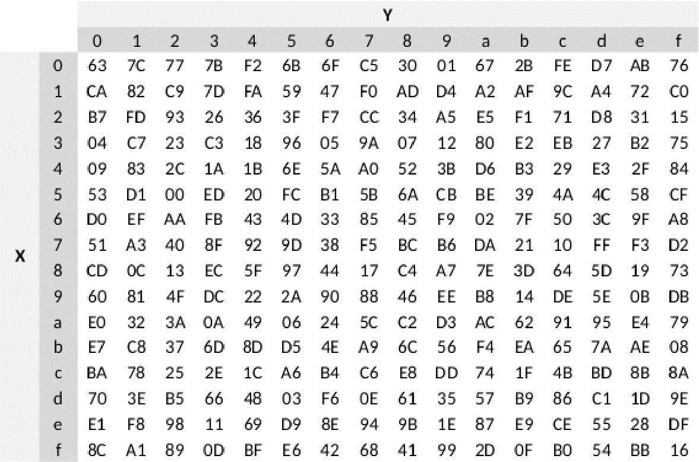

# Criptografia AES -> Como é construído o algoritmo?

A criptografia AES (Advanced Encryption Standard) é uma criptografia 
simétrica, ou seja, a mesma chave usada para criptografar é usada para 
descriptografar.
Por padrão vem com bloco fixo de 128 bits, mas pode ser de 192 ou 256 bits

## O que precisamos saber?

- O que são bits?
  
bit é a menor unidade de informação computacional,
1 caractere tem 1 Byte que contém 8 bits.
Então uma chave de 128 bits contém 16 caraceres (16 x 8 = 128).

- Converter Bits para decimal.

Existe uma maneira muito simples de converter bits para decimal,
separamos 8 bits e classificamos cada um por "casas" de 7 a 0. Cada casa
representa um expoente que será feito por base 2.

Ou seja: 2⁷ = 128, 2⁶ = 64, 2⁵ = 32, 2⁴ = 16, 2³ = 8, 2² = 4, 2¹ = 2, 2⁰ = 1

Multiplicamos cada bit pelo resultado de cada potência, e somamos todos os
valores.

| Índice | Bit |
|:------:|:---:|
|    7   |  1  |
|    6   |  0  |
|    5   |  1  |
|    4   |  1  |
|    3   |  0  |
|    2   |  0  |
|    1   |  1  |
|    0   |  0  |


128 + 0 + 32 + 16 + 0 + 0 + 2 + 0 = 178

- Convertendo para Hexadecimal/ASCII:

Cada caractere seja pontuação, letras ou números tem sua codificação de
acordo com a tabela Unicode, Exemplo.: "A" na tabela representa 65, por ordem,
os números de 0 até 31 são destinados aos caracteres de controle (esc, \n, \r)
Os números de 32 até 64 são símbolos (@, !, ?, %), e apartir do 65 até 126
são os caracteres comuns (A, B, C, a, b, c, 1, 2, 3) também inclui ([], \, ^,
_, {}, |, ~) e assim sucessivamente.


Com o resultado em decimal (178) fazemos a divisão do valor pelo divisor 16 e
guardamos o resto da divisão.

```
178 ÷ 16 = 11 (resto 2)
11 % 16 = 0 (resto 11)
```

Em Hexadecimal deve-se conter 16 valores diferentes, são eles:

| Valor  | Hex |
| ------ |:---:|
|   0    |  0  |
|   1    |  1  |
|   2    |  2  |
|   3    |  3  |
|   4    |  4  |
|   5    |  5  |
|   6    |  6  |
|   7    |  7  |
|   8    |  8  |
|   9    |  9  |
|  10    |  A  |
|  11    |  B  |
|  12    |  C  |
|  13    |  D  |
|  14    |  E  |
|  15    |  F  |

Os valores de 10 a 15 são representados por letras e os resultados
das divisões são lidos de baixo para cima, com isso:
>```
>178 ÷ 16 = 11 (resto 2)
>11 % 16 = 0 (resto 11)
>```

O valor decimal 178 em hexadecimal é ```0xB2```.


Sendo assim, damos o ponta-pé inicial ao algorítimo. Para que a mensagem seja
criptografada ela precisa passar por 4 processos que serão repetidos depois
como rodadas.

## Processo 1 - KeyExpansion.

- É nesse processo que é de é definido as rodadas de acordo com o tamanho
das chaves. É feita uma lógica parecida com o da criptografia, dentre os
processos estão: Rotação de palavras, substituição de cada byte pela tabela
s-box, xor de cada byte com uma outra tabela chamada rcon.
```
10 rodadas - 128 bits
12 rodadas - 192 bits
14 rodadas - 256 bits
```

## Processo 2 - AddRoundKey.

- cada byte da chave é combinado com os bytes da mensagem numa matriz 4x4
usando operação XOR bit a bit. É feita a combinação de cada bit de cada bytes
da chave com cada bit de cada bytes da mensagem.

Dessa forma, "A" em binário é 01000001 e "B" 01000010, fazendo a
combinação sabendo que, se os valores forem iguais ele será 0 (1 - 1 = 0),
e se um valor um a for 1 e o valor b for 0 retorna 1 (1 - 0 = 1).

```
0 1 0 0 0 0 0 1
| | | | | | | |
0 1 0 0 0 0 1 0
= = = = = = = =
0 0 0 0 0 0 1 1
 ```

Nesse exemplo o resultado do xor bit a bit de "A" e "B" é ```00000011```, agora
é feito uma potenciação com base 2 e expoente 7 regredindo até o expoente 0 e
todos os valores da potenciação são multiplicados com o cada valor de cada bit
 
```
0 x 128 = 0
0 x 64 = 0
0 x 32 = 0
0 x 16 = 0
0 x 8 = 0
0 x 4 = 0
1 x 2 = 2
1 x 1 = 1
```

A soma de todos os valores resulta em um novo byte.
A partir dessa lógica é feito com todos os outros, bloco por bloco de 
16 bytes, e se a mensagem conter menos de 16 bytes padrão ou menor que o
tamanho da chave, é feito o chamado 'Padding' (ou preenchimento) em hex
nulos mesmo, apenas para completar o bloco fazendo assim uma condição.

## Processo 3 - 9, 11 ou 13 rodadas.

1. SubBytes - após a AddRoundKey é feita a substituição de caracteres 
(bytes) de forma não linear onde cada Byte em hexadecimal é substituido por
outro de acordo com a tabela S-Box, o primeiro valor define a linha da tabela
e o segundo valor define a coluna.



2. ShiftRows - Neste processo, as 3 ultimas linhas sofrem um deslocamento para
a sua esquerda da seguinte forma.
A primeira linha não sofre alteração,
A segunda linha todos são deslocados para a esquerda pulando uma casa,
A Terceira linha pulando duas casas,
E a quarta pulando três casas.

Exemplo.:

| a0 | a1 | a2 | a3 |
|----|----|----|----|
| b0 | b1 | b2 | b3 |
| c0 | c1 | c2 | c3 |
| d0 | d1 | d2 | d3 |

com o deslocamento.:

| a0 | a1 | a2 | a3 |
|----|----|----|----|
| b1 | b2 | b3 | b0 |
| c2 | c3 | c1 | c0 |
| d3 | d0 | d1 | d2 |

3. MixColumns - Nessa etapa cada coluna faz uma operação de multiplicação de
campo finito GF(2⁸), como exemplo temos o valor em hex 0xC1 em binário esse
valor é -> 11000010, no MixColumns é feito um shift para a esquerda do bit
mais significativo que seja 1, caso o mais significativo for 7 ele fará o shift
para a esquerda e será transbordado, com isso é adicionado o bit 0 na direita,
se após o shift o mais significativo for 7 é feito um xor com o valor 0x1B:

| 0x02 | 0x03 | 0x01 | 0x01 |
|------|------|------|------|
| 0x01 | 0x02 | 0x03 | 0x01 |
| 0x01 | 0x01 | 0x02 | 0x03 |
| 0x03 | 0x01 | 0x01 | 0x02 |

4. AddRoudKey - É feito mais uma vez o precesso de xor bit a bit.

## Processo Final - Ultima rodada (10, 12, 14).

- Na ultima rodada é repetido mais uma vez 3 etapas, são elas: SubBytes,
ShiftRows e AddRoudKey. 

## Processo de Descriptografia:

- No processo de descriptografia, é feito da mesma forma porém inverso.

- InvShiftRows - Todos os bytes voltam a sua posição:

| a0 | a1 | a2 | a3 |
|----|----|----|----|
| b0 | b1 | b2 | b3 |
| c0 | c1 | c2 | c3 |
| d0 | d1 | d2 | d3 |

- InvSubBytes - O valor hex encontrado na tabela é retornado ao valor anterior
de acordo com a sua linha e a coluna.

- InvAddRoundKey - O xor bit a bit pode ser reversível, se a ⊕ b = c, 
consecutivamente c ⊕ b = a. Isso é feito de 1-9 rodadas.

- InvMixColumns - No MixColumns é feito com valores fixos de uma matriz, mas não
com os mesmos do processo da criptografia.

| 0E | 0B | 0D | 09 |
|----|----|----|----|
| 09 | 0E | 0B | 0D |
| 0D | 09 | 0E | 0B |
| 0B | 0D | 09 | 0E |

# Explicação do Código.

> Mapa Mental:

```
main
├── aes.py
│
├── key_expansion/
│   └── key_expansion.py
|
├── mixcolumns/
│   └── mixcolumns.py
|
├── rcon/
│   └── rcon.py
|
├── sbox/
│   └── sbox.py
```

## 1. key_expansion.py

Começamos pelo KeyExpansion, principal módulo que define o rumo da criptografia

### 1.1 Rotação de bytes

>```py
>def rot_byte(self, data):
>    return data[1:] + data[:1]
>```

- Nessa função é feito o split da data recebida onde ```data[1:] + data[:1]```
faz a rotação do primeiro byte e do último byte ```[A, B, C, D]```
```resultado = [D, B, C, A]```

### 1.2 SubBytes

>```py
>def sub_byte(self, data, sbox):
>    return [sbox[(b >> 4) & 0x0F][b & 0x0F] for b in data]
>```

- Nessa função retorna o índice da matriz sbox, o cada byte em data é separado
em 2: b >> 4 move os 4 bits mais significativos para a direita e faz a operação
END (&) com 0x0F. Esse operador ele retorna 1 se ambos bits de a & b forem 1.
dessa forma os 4 mais significativos definem a linha da matriz e os 4 menos 
significativos definem a coluna.

### 1.3 XOR Bit a Bit

>```py
>def xor_byte(self, a, b):
>    return [x ^ y for x, y in zip(a, b)]
>```

- Nessa função é feito o XOR bit a bit de um bit a e um bit b.
na operação XOR se: 0 ^ 0 = 0, 1 ^ 0 = 1, 1 ^ 1 = 0

### 1.4 Expansão de Chave

>```py
>def keyexpansion(self):
>    palavras = (44 if len(self.key) == 16 else 52 if len(self.key) == 24 else 60)
>    grupos_palavras = (4 if palavras == 44 else 6 if palavras == 52 else 8)
>
>    bloco = [list(self.key[i:i+4]) for i in range(0, 16, 4)]
>    
>    for i in range(4, palavras):
>        palavra_temp = bloco[i - 1]
>        if i % 4 == 0:
>            palavra_temp = self.rot_byte(palavra_temp)
>            palavra_temp = self.sub_byte(palavra_temp, sbox)
>            palavra_temp = self.xor_byte(palavra_temp, rcon[i // grupos_palavras])
>
>        novos_bytes = self.xor_byte(bloco[i - 4], palavra_temp)
>        bloco.append(novos_bytes)
>
>    return [sum(bloco[i:i+4], []) for i in range(0, palavras, 4)]
>```

- Aqui é definido quantas subchaves serão criadas de acordo com o tamanho da
chave original, subchave de 44 palavras se for 16 bytes, 52 para 24 bytes e 60
para 32 byes. Para cada quantidade de palavra é dividido em grupos de palavras
4 para 44, 6 para 52, 8 para 60.

```py
palavras = (44 if len(self.key) == 16 else 52 if len(self.key) == 24 else 60)
grupos_palavras = (4 if palavras == 44 else 6 if palavras == 52 else 8)
```

- Nessa linha divide a chave em uma matriz 4x4, ou seja 16 Bytes

```py
bloco = [list(self.key[i:i+4]) for i in range(0, 16, 4)]
```

- iniciar um for até a quantidade final de palavras, palavra_temp recebe o
ultimo bloco gerado

```py
for i in range(4, palavras):
    palavra_temp = bloco[i - 1]
    if i % 4 == 0:
```
- rcon[i // grupos_palavras] Pega o índice do elemento da tabela [rcon](/rcon/rcon.py)

```py
palavra_temp = self.rot_byte(palavra_temp)
palavra_temp = self.sub_byte(palavra_temp, sbox)
palavra_temp = self.xor_byte(palavra_temp, rcon[i // grupos_palavras])
```

- Faz o XOR com 4 bits anteriores do bloco com os bits da palavra temporária e
adiciona ao bloco os novos bytes

```py
novos_bytes = self.xor_byte(bloco[i - 4], palavra_temp)
bloco.append(novos_bytes)
```
- Essa linha é responsável por concatenar a cada 4 bytes da matriz e transformar
em uma lista linear

```py
return [sum(bloco[i:i+4], []) for i in range(0, palavras, 4)]
```

## 2. aes.py

Módulo principal da criptografia AES.

### 2.1 Campo Finito

>```py
>def campo_finito(self, a, b):
>    acumulador = 0
>    for i in range(8):
>        if b & 1:
>            acumulador ^= a
>        mais_significativo = a & 0x80
>        a = (a << 1) & 0xFF 
>        if mais_significativo:
>            a ^= 0x1B
>        b >>= 1
>    return acumulador 
>```

- Multiplicação do campo finito GF(2⁸) é um dos processos do [MixColumns](#26-mixcolumns).
Iniciamos com um for in range(8) pois são 8 bits.

```py
for i in range(8):
```

Se o bit menos significativo de b for 1 então é adicionado a ao acumulador usando
XOR.

```py
if b & 1:
    acumulador ^= a
```
Verificamos se o bit de a mais significativo é o bit 7, isso determina se uma
redução polinomial.

```py
mais_significativo = a & 0x80
```

Deslocamos um bit de a para a esqueda e (& 0xFF) garante que o byte terá 8 bits

```py
a = (a << 1) & 0xFF
```

Se o bit mais significativo ```mais_significativo``` estiver ativo, fazemos a
redução com XOR de (a ^= 0x1B)

```py
if mais_significativo:
    a ^= 0x1B
```

Por fim deslocamos um bit para a direita de b para processar o proximo bit
e retornamos o valor acumulado.

```py
    b >>= 1
return acumulador
```

### 2.2 Padding

>```py
>def pcks7_pad(self, data: bytes, tamanho_bloco=16):
>    tamanho_pad = tamanho_bloco - (len(data) % tamanho_bloco)
>    pad = bytes([tamanho_pad] * tamanho_pad)
>    return data + pad
>```

- Função responsável pelo preenchimento de bytes faltando, se faltam 5 bytes 
para completar 16 bytes, ele preenche com 5 bytes ```\x05```, e assim
sucessivamente para 32 e multiplos de 16.

### 2.3 Unpadding

>```py
>def pcks7_unpad(self, data: bytes):
>    tamanho_pad = data[-1]
>    if tamanho_pad < 1 or tamanho_pad > 16:
>        raise ValueError('padding inválido')
>    if data[-tamanho_pad:] != bytes([tamanho_pad] * tamanho_pad):
>        raise ValueError('padding inválido #2')
>    return data[:-tamanho_pad]
>```

- Função responsável por remover o preenchimento, tamanho_ad recebe o ultimo
byte de data (no caso data[-1]), se o tamanho_pad for menor que 1 (0) ou maior
que 16 levanta um erro de valor, pois o preenchimento só pode ser feito de 1 até
16.
Se o ultimo byte de pad for diferente do tamanho total de padding também levanta
um erro de valor, caso contrário retorna o data sem o tamanho_pad,
(data[:-tamanho_pad])

### 2.4 AddroundKey

>```py
>def addroundkey(self, bloco, round_key):
>    result = bytes([b ^ k for b, k in zip(bloco, round_key)])
>    return result
>```

- Faz um XOR entre cada bit do bloco de 4x4 com cada bit da chave

### 2.5 ShiftRows

>```py
>def shiftrows(self, matriz):
>    for i in range(1, 4):
>        matriz[i] = matriz[i][i:] + matriz[i][:i]
>    return matriz
>```

- Função responsável pela troca de posição dos índices, exemplo.:
[A, B, C, D]

i = 2
2 = B

matriz[2] = matriz[2][2:] + matriz[2][:2] = [C, D, A, B]

### 2.6 MixColumns

>```py
>def mixcolumns(self, matriz, matriz_mix):
>    nova_matriz = []
>
>    for coluna_transposta in matriz:
>        nova_coluna = []
>        for linha_mixcolumns in matriz_mix:
>            acumulador = 0
>            for i, j in zip(linha_mixcolumns, coluna_transposta):
>                acumulador ^= self.campo_finito(j, i)
>            nova_coluna.append(acumulador)
>        nova_matriz.append(nova_coluna)
>```

- Essa função faz a multiplicação pelo campo finito de cada bloco 4x4 do data 
por uma matriz fixa exigida pelo método AES.

```nova_matriz = []``` é a variável que armazenará a matriz quando passar por
todos os loops.

Transformando o texto com padding em uma lista separando cada índice e em
seguida monta uma matriz 4x4

>```py
>for i in range(0, len(texto_com_pad), 16)
>    estado = list(texto_com_pad[i:i+16]) # ['1', '2', '3', '4', '5', '6', '7'...]
>    matriz = [list(estado[i:i + 4]) for i in range(0, 16, 4)] # matriz 4x4
>```

Com a matriz montada, fazemos a trasposição dela, ou seja as linhas de uma
matriz vira colunas.

```py
transposta = list(zip(*matriz))
```
Esse for itera em cada índice de uma matriz transposta.

```py
for coluna_transposta in matriz
```

```nova_coluna = []``` armazena a nova coluna formada depois do loop interno

Itera em cada índice da matriz fixa do [MixColumns](/mixcolumns/mixcolumns.py)
e adiciona um acumulador.

```py
for linha_mixcolumns in matriz_mix:
    acumulador = 0
```
Próximo for itera entre cada item da linha da matriz do mixcolumns e cada 
item da coluna da transposta, em seguida faz o XOR e acumula o resultado da
multiplicação do campo finito de j e i.

```py
for i, j in zip(linha_mixcolumns, coluna_transposta):
    acumulador ^= self.campo_finito(j, i)
```
Adiciona os resultados na nova matriz.

```py
    nova_coluna.append(acumulador)
nova_matriz.append(nova_coluna)
```

### 2.7 InvShiftRows

>```py
>def invshiftrows(self, matriz):
>    for i in range(1, 4):
>        matriz[i] = matriz[i][-i:] + matriz[i][:-i]
>    return matriz
>```

- Processo inverso do [ShiftRows](#25-shiftrows)

### 2.8 InvSubBytes

```py
def invsubbytes(self, matriz):
    for r in range(4):
        for c in range(4):
            b = matriz[r][c]
            matriz[r][c] = inv_sbox[(b >> 4) & 0x0F][b & 0x0F]
    return matriz
```

- Processo inverso do [SubBytes](#12-subbytes) usando a tabela inversa [inv_Sbox](/sbox/sbox.py)