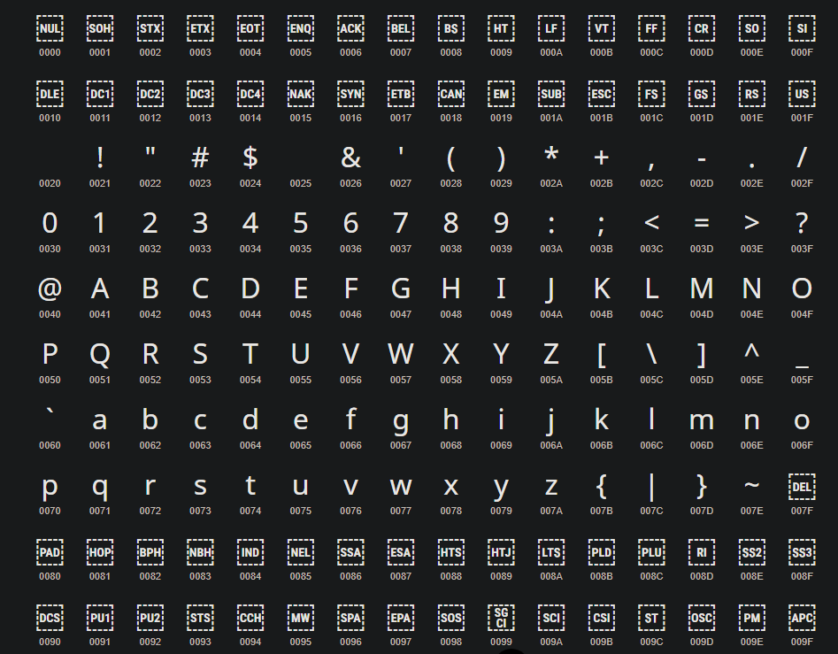

# Criptografia AES -> Como é construído o algoritmo?

A criptografia AES (Advanced Encryption Standard) é uma criptografia 
simétrica, ou seja, a mesma chave usada para criptografar é usada para 
descriptografar.
Por padrão vem com bloco fixo de 128 bits, mas pode ser de 192 ou 256 bits
- O que são bits?
  
bit é a menor unidade de informação computacional,
1 caractere tem 1 Byte que contém 8 bits.
Então uma chave de 128 bits contém 16 caraceres (16 x 8 = 128).

- Convertendo cada Byte para hexadecimal:

essa chave é convertida para hexadecimal (hex) que funciona da seguinte
maneira.
Cada caractere seja pontuação, letras ou números tem sua codificação de
acordo com a tabela Unicode, Exemplo.: "A" na tabela representa 65, por ordem,
os números de 0 até 31 são destinados aos caracteres de controle (esc, \n, \r)
Os números de 32 até 64 são símbolos (@, !, ?, %), e apartir do 65 até 126
são os caracteres comuns (A, B, C, a, b, c, 1, 2, 3) também inclui ([], \, ^,
_, {}, |, ~).



Sabendo que "A" representa 65, para converter em hex basta pegar o valor
e fazer a divisão inteira por 16, reservar o resultado que será o primeiro
valor e fazer o resto da divisão e reservar o valor para a segunda posição.

```65 ÷ 16 = 4 (resto 1)```

Por tanto, o hexadecimal de "A" é 0x41, caso o valor seja maior que 9 já não
é tratado mais com números e sim com letras, pois o hexadecimal tem que ser
composto por 16 caracteres puros.

```
0 = 0
1 = 1
2 = 2
3 = 3
4 = 4
5 = 5
6 = 6
7 = 7
8 = 8
9 = 9
10 = A
11 = B
12 = C
13 = D
14 = E
15 = F
```

Sendo assim, damos o ponta-pé inicial ao algorítimo. Para que a mensagem seja
criptografada ela precisa passar por 4 processos que serão repetidos depois
como rodadas.

## Processo 1 - KeyExpansion.
- É nesse processo que é de é definido as rodadas de acordo com o tamanho
das chaves. É feita uma lógica parecida com o da criptografia, dentre os
processos estão: Rotação de palavras, substituição de cada byte pela tabela
s-box, xor de cada byte com uma outra tabela chamada rcon.
```
10 rodadas - 128 bits
12 rodadas - 192 bits
14 rodadas - 256 bits
```

## Processo 2 - AddRoundKey.
- cada byte da chave é combinado com os bytes da mensagem numa matriz 4x4
usando operação bit por bit xor, que irei explicar como funciona.
tomando como exemplo o "A" que na tabela é 65, transformando para binário
seria da seguinte maneira.:

```
65 ÷ 2 = 32 (resto 1)
32 ÷ 2 = 16 (resto 0)
16 ÷ 2 = 8 (resto 0)
8 ÷ 2 = 4 (resto 0)
4 ÷ 2 = 2 (resto 0)
2 ÷ 2 = 1 (resto 0)
1 ÷ 2 = 0 (resto 1)
```

É feito a divisão sucessiva de 2 até não ser possível dividir, no final é
lido inverso. 

sendo assim é feito a combinação de cada bit de cada bytes da chave com
cada bit de cada bytes da mensagem.

Dessa forma, "A" em binário é 01000001 e "B" 01000010, fazendo a
combinação sabendo que, se os valores forem iguais ele será 0 (1 - 1 = 0),
e se um valor um a for 1 e o valor b for 0 retorna 1 (1 - 0 = 1).

```
0 1 0 0 0 0 0 1
| | | | | | | |
0 1 0 0 0 0 1 0
= = = = = = = =
0 0 0 0 0 0 1 1
 ```

Nesse exemplo o resultado do xor bit a bit de "A" e "B" é ```00000011```, agora
é feito uma potenciação com base 2 e expoente 7 regredindo até o expoente 0.

```
2⁷ = 128
2⁶ = 64
2⁵ = 32
2⁴ = 16
2³ = 8
2² = 4
2¹ = 2
2⁰ = 1
```

Todos os valores da potenciação são multiplicados com o cada valor de cada bit
 
```
0 x 128 = 0
0 x 64 = 0
0 x 32 = 0
0 x 16 = 0
0 x 8 = 0
0 x 4 = 0
1 x 2 = 2
1 x 1 = 1
```

A soma de todos os valores resultam em um identificador de um dos caracteres
da tabela unicode, nesse caso 3 é um caractere de controle não imprimível
mas convertido para hexadecimal essa seria sua representação ```\x03```.

a partir dessa lógica é feito com todos os outros, bloco por bloco de 
16 bytes, e se a mensagem conter menos de 16 bytes padrão ou menor que o
tamanho da chave, é feito o chamado 'Padding' (ou preenchimento) em hex
nulos mesmo, apenas para completar o bloco fazendo assim uma condição.

## Processo 3 - 9, 11 ou 13 rodadas.
1. SubBytes - após a AddRoundKey é feita a substituição de caracteres 
(bytes) de forma não linear onde cada Byte em hexadecimal é substituido por
outro de acordo com a tabela S-Box, o primeiro valor define a linha da tabela
e o segundo valor define a coluna.


2. ShiftRows - Neste processo, as 3 ultimas linhas sofrem um deslocamento para
a sua esquerda da seguinte forma.
A primeira linha não sofre alteração,
A segunda linha todos são deslocados para a esquerda pulando uma casa,
A Terceira linha pulando duas casas,
E a quarta pulando três casas.

Exemplo.:

```
[a0, a1, a2, a3]
[b0, b1, b2, b3]
[c0, c1, c2, c3]
[d0, d1, d2, d3]
```

com o deslocamento.:
```
[a0, a1, a2, a3]
[b1, b2, b3, b0]
[c2, c3, c1, c0]
[d3, d0, d1, d2]
```
3. MixColumns - Nessa etapa cada coluna faz uma operação de multiplicação de
campo finito GF(2⁸), como exemplo temos o valor em hex 0xC1 em binário esse
valor é -> 11000010, no MixColumns é feito um shift para a esquerda do bit
mais significativo que seja 1, caso o mais significativo for 7 ele fará o shift
para a esquerda e será transbordado, com isso é adicionado o bit 0 na direita,
se após o shift o mais significativo for 7 é feito um xor com o valor 0x1B:
```
[0x02, 0x03, 0x01, 0x01]
[0x01, 0x02, 0x03, 0x01]
[0x01, 0x01, 0x02, 0x03]
[0x03, 0x01, 0x01, 0x02]
```
4. AddRoudKey - É feito mais uma vez o precesso de xor bit a bit.

## Processo Final - Ultima rodada (10, 12, 14).
- Na ultima rodada é repetido mais uma vez 3 etapas, são elas: SubBytes,
ShiftRows e AddRoudKey. 

## Processo de Descriptografia:
- No processo de descriptografia, é feito da mesma forma porém inverso.

- InvShiftRows - Todos os bytes voltam a sua posição:

```
[a0, a1, a2, a3]
[b0, b1, b2, b3]
[c0, c1, c2, c3]
[d0, d1, d2, d3]
```

- InvSubBytes - O valor hex encontrado na tabela é retornado ao valor anterior
de acordo com a sua linha e a coluna.

- InvAddRoundKey - O xor bit a bit pode ser reversível, se a ⊕ b = c, 
consecutivamente c ⊕ b = a. Isso é feito de 1-9 rodadas.

- InvMixColumns - No MixColumns é feito com valores fixos de uma matriz, mas não
com os mesmos do processo da criptografia.

```
[0E 0B 0D 09]
[09 0E 0B 0D]
[0D 09 0E 0B]
[0B 0D 09 0E]
```
